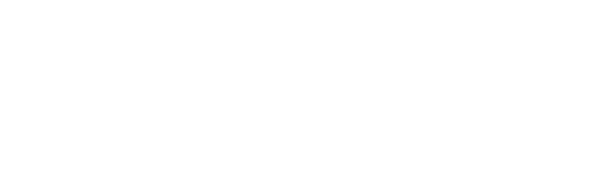

# RunTrack

## Beschreibung
Dieses Projekt wurde erstellt für den Klimalauf
und ist auch eine Übung für die Projektarbeit in der 12. Klasse.
Das Projekt ist ein Programm für die Verwaltung von Schülerläufen.
Dieses Programm ist gedacht für Schulen, die einen Lauf veranstalten.
Es ist in C# WPF geschrieben und verwendet eine SQLite Datenbank, die mit Entity Framework Core verwaltet wird.
In diesem Projekt haben wir auch gelernt, wie man mit Git und GitHub zusammenarbeitet.

## Features
- Login System mit einen Admin der beim Ersten Start erstellt wird
- Datenübersicht für Schulen, Klassen, Schüler, Rundenarten, etc
- Generierung von Barcodes der Schüler in einem eingebauten PDF-Editor
- Scannen von Barcodes und speichern der Runden mit Liste der zuletzt gescannten Schüler
- Auswertung der Daten in Diagrammen und Tabellen
- Erstellung von Urkunden und Bewertungen für die Schüler als PDF
- Export und Import von Daten und Datenbank
- Einstellungen für das Programm

## Anleitung
TODO

## Mitwirkende
- [Paul Fischer](https://github.com/Fuxson)
- [Sascha Dierl](https://github.com/KreativeName1)
- [Simon Glisnik](https://github.com/CyberEnte)
- [Giada D'Aleo](https://github.com/GD1900)
- [Niko Neumeier](https://github.com/user10201)

## Lizenz

